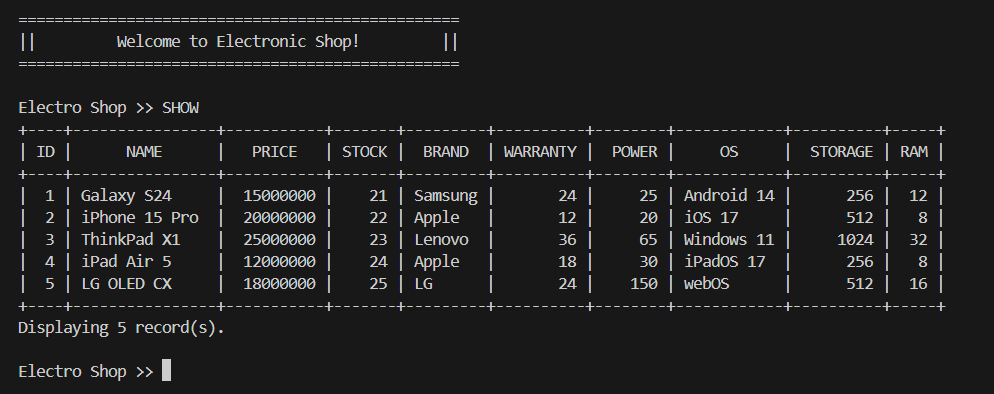

# Janji
Saya Muhammad 'Azmi Salam dengan NIM 2406010 mengerjakan Tugas Praktikum 1 pada Mata Kuliah Desain dan Pemrograman Berorientasi Objek (DPBO) untuk keberkahan-Nya maka saya tidak melakukan kecurangan seperti yang telah dispesifikasikan. Aamiin

# Struktur File
```
Main
├── CPP/
│   ├── Program
│   │   ├── Electronic.cpp
│   │   ├── Device.cpp
│   │   ├── SmartDevice.cpp
│   │   └── main.cpp
│   │
│   └── Dokumentasi
│       ├── cpp1.jpg
│       └── cpp2.jpg
│
├── Java/
│   ├── Program
│   │   ├── Electronic.java
│   │   ├── Device.java
│   │   ├── SmartDevice.java
│   │   └── Main.java
│   │
│   └── Dokumentasi
│       ├── java1.jpg
│       └── java2.jpg
│
├── Python/
│   ├── Program
│   │   ├── Electronic.py
│   │   ├── Device.py
│   │   ├── SmartDevice.py
│   │   └── main.py
│   │
│   └── Dokumentasi
│       ├── py1.jpg
│       └── py2.jpg
│
├── PHP/
│   ├── Program
│   │   ├── Electronic.php
│   │   ├── Device.php
│   │   ├── SmartDevice.php
│   │   ├── index.php
│   │   └── images/
│   │       └── *.jpg
│   │
│   └── Dokumentasi
│       └── php.mp4
│
└── README.md
```

# Diagram


# Desain
Program terdiri dari __3__ class, yaitu __Electronic__, __Device__, dan __SmartDevice__. Program menggunakan Multilevel Inheritance, dengan __Electronic__ sebagai class induk, dilanjutkan dengan __Device__, dan __SmartDevice__ sebagai class paling bawah. Urutan inheritance ini dibuat karena class Electronic memiliki atribut paling general di antara ketiganya dan class SmartDevice yang memiliki atribut paling spesifik pula. Berikut masing-masing atribut class:
- Electronic:
  - ID
  - Name
  - Stock
  - Price
  - Photo (khusus PHP)
- Device
  - Brand
  - Warranty
  - Power
- SmartDevice
  - OS
  - Storage
  - RAM

# Flow Code & Panduan Penggunaan
```
============================================================================
|+------------------------------------------------------------------------+|
||                                                                        ||
||     <<<<<<<<<<<<<  BUKU PANDUAN MENGGUNAKAN KODE  >>>>>>>>>>>>>        ||
||                                                                        ||
||     1. Pilih Masukan Perintah Dengan Format Seperti Di Bawah.          ||
||        TIDAK CASE SENSITIVE!!!!                                        ||
||        a. Perintah Langsung:                                           ||
||           HELP                                                         ||
||           -Berfungsi Untuk Menampilkan Buku Panduan.                   ||
||           SHOW                                                         ||
||           -Berfungsi Untuk Menampilkan Data Saat Ini.                  ||
||           EXIT                                                         ||
||           -Berfungsi Untuk Mengakhiri Program.                         ||
||                                                                        ||
||        b. Perintah Data:                                               ||
||             +----------+                                               ||
||             | PERINTAH |                                               ||
||             +----------+                                               ||
||             |  INSERT  |                                               ||
||             |  UPDATE  |                                               ||
||             |  DELETE  |                                               ||
||             |  SEARCH  |                                               ||
||             +----------+                                               ||
||                                                                        ||
||     2. Jika Anda Memilih INSERT. Maka Tulis Nama, Kategori, dan        ||
||        Harga (String Wajib Diapit Dengan Tanda Petik Dua,              ||
||        CTH: "Handphone")                                               ||
||        FORMAT QUERY :                                                  ||
||          INSERT "[Nama]" "[Kategori]" [Harga]                          ||
||                                                                        ||
||                                                                        ||
|+------------------------------------------------------------------------+|
============================================================================
```

# Dokumentasi

## C++
<div>
    
    
</div>

## JAVA
<div>
    
    
</div>

## PYTHON
<div>
    
    
</div>

## PHP
<div>
    <a>Klik untuk melihat vidio dokumentasi</a><br><br>
    <a href="https://youtu.be/3H8kubvpiJM"></a>
    <video src="Dokumentasi/php/php.mkv" controls width="600"></video>
</div>